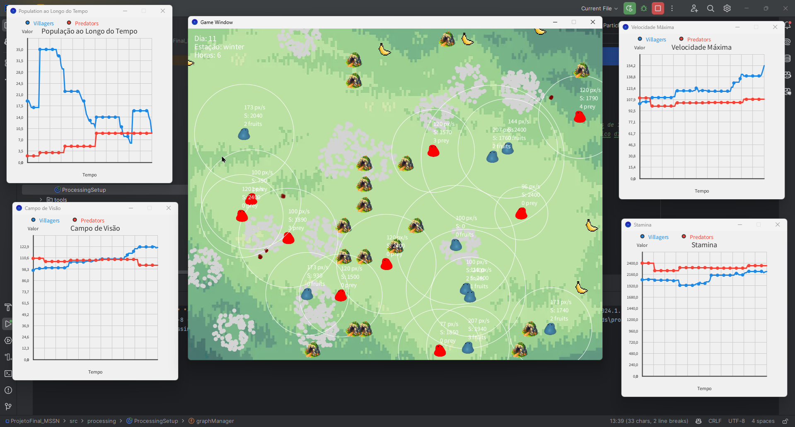

# EcoSim - Ecosystem Simulation

This is my version of a virtual ecosystem simulation built in Java that models the dynamics of a natural environment where entities interact, evolve and adapt to seasonal changes and resource limitations. This project demonstrates the application of complex system modeling, agent-based simulation, and adaptive behavior, all structured with clean code principles, scalable design patterns, and Object-Oriented Programming (OOP).

## Project Highlights

* **Complex Ecosystem Simulation:** Entities compete for resources, evolve through genetic mutations and face natural challenges such as predation, seasonal changes, and resource scarcity.
* **Real-time Monitoring:** Graphical representations of population trends and evolutionary progress.
* **Genetic Evolution:** Entities evolve over generations with genetic mutations that affect characteristics such as speed, energy, and vision range.
* **Interactive Environment:** Users can control an entity and influence the ecosystem outcome by directly interacting with it.
* **Robust Architecture:** Modular and scalable codebase with a clear separation of concerns.
* **Advanced Visuals:**
  * **Fractals:** Used for generating trees in the ecosystem.
  * **Particle Systems:** Simulate dynamic elements such as snow in winter, blood when a blob dies, and movement particles when the user controls a blob.
  * **Physics-based Movements:** Implemented using vectors and Newton's second law of motion, F=m⋅a.
  * **PApplet Integration:** Entire visual interface created using the PApplet library.

## Core Architecture

The project is divided into two main packages that organize the system logically:

### Core

* **GameManager:** Coordinates the ecosystem simulation, manages game state and handles resource and population initialization.
* **Game:** Drives the temporal evolution of the system, managing entity behaviors and interactions over time.
* **InteractionManager:** Handles entity interactions such as predation, reproduction and responses to environmental changes.
* **GraphManager:** Visualizes statistical data in real time of population dynamics and evolutionary trends.

### Model

* **World:** Defines the ecosystem's structure using a grid system. Each grid cell organizes entity spawns.
* **Factory:** Implements the Factory design pattern to create entities like blobs, trees, and fruits efficiently.
* **Entity:** Encapsulates all ecosystem entities, including:
  * **Animals:**
    * **Blobs:** Passive and predator types, each with distinct survival strategies and behaviors.
  * **Plants:** Trees and other stationary elements that influence the ecosystem.
  * **Resources:** Fruits that sustain passive blobs and affect ecosystem dynamics.

## Gameplay Overview

The simulation follows the life cycle of entities within the ecosystem:

* **Movement and Behavior:** Entities exhibit realistic behaviors like seeking food, fleeing predators and wandering.
* **Genetic Evolution:** Entities evolve through generational mutations.
* **Seasonal Changes:** Seasonal (summer/winter) resource fluctuations affect entity survival, visualized through graphs.
* **Interactivity:** Users can pause/reset the game, add entities and control specific blobs so they can influence the ecosystem's evolution directly.

## Technical Skills Demonstrated

### Design Patterns

* **Factory:** Streamlines entity creation (e.g., blobs, trees, fruits), ensuring scalability and flexibility for future enhancements.

### OOP Principles

* **Encapsulation, Inheritance, and Polymorphism:** Manage entity behaviors and interactions cohesively.
* **Modularity:** Ensures a clean, maintainable structure with a clear separation of responsibilities.

### Physics and Visual Enhancements

* **Physics-based Movement:** Implemented using vectors and laws of motion, creating realistic entity behaviors.
* **Fractals:** Generate trees for the ecosystem.
* **Particle Systems:**
  * Snowfall during winter seasons.
  * Blood particles upon entity deaths.
  * Movement trails for user-controlled blobs.

## Visual Interface

### PApplet Based Interface
  
*Visualizing the game interface: graphs and main game window.*

### Comprehensive Class Diagram
  
*Visualizing key classes and their relationships.*

## Future Enhancements

* **Expanded Biomes:** Introduce diverse ecosystems with unique resources and challenges.
* **Advanced Genetic Algorithms:** Develop more complex mutation models for more realistic evolutionary dynamics.
* **Improved Interactions:** Expand behaviors and interactions, including cooperation and complex predation.

## How to Run

1. Clone the repository.
2. Compile and execute the program using:

```bash
java -jar ecosim-game.jar
